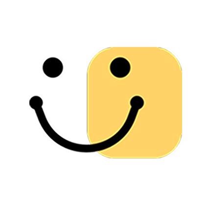

# 희소식
분노 유발 컨텐츠는 이제 그만! 긍정뉴스 추천 & 참여형 게시글 애플리케이션

---

### 💡 기획의도

- 부정적인 뉴스 소비로 인한 정신적 피로와 우울감을 줄이고 사용자가 긍정적인 뉴스를 쉽게 접하며 직접 긍정적인 경험을 공유할 수 있도록 돕는 앱 서비스이다. 긍정 뉴스에 대한 감정 평가 및 스크랩 기능을 통해 사용자가 능동적으로 참여하도록 유도하고 긍정적인 뉴스 소비를 지속할 수 있도록 동기 부여를 이끈다.

---

### 🎯 타겟층

- 부정적인 컨텐츠에 우울감, 피로감을 느끼는 사람들

---

### ⭐ 주요 기능

- **뉴스 소비 시간 설정** : 사용자가 뉴스를 가장 많이 보는 시간에 맞춰 푸시 알림 전송
- **맞춤형 긍정 뉴스** : 사용자가 선택한 긍정 키워드를 기반으로 웹 크롤링을 활용해 해당 날짜의 긍정 뉴스를 랜덤 제공
- **긍정 뉴스 감정 평가** : 뉴스에 대한 감정 평가 기능 제공 -> 평가 결과는 감정 그래프 데이터에 활용
- **희소식** : 사용자가 원하는 주제를 기반으로 플레이스 생성 및 참여 가능, 긍정적인 뉴스와 경험 등 다양한 희소식 공유
- **나의 감정 그래프** : 사용자의 긍정 뉴스 감정 평가 결과를 바탕으로, 기간별 감정 그래프를 통해 감정 변화 비교 가능 -> 사용자가 긍정 뉴스 소비를 지속할 수 있도록 동기 부여
- **푸시 알림** : 사용자가 뉴스를 가장 자주 보는 시간에 맞춰 맞춤형 긍정 뉴스 푸시 알림 및 희소식 새로운 답글, 좋아요 푸시 알림 제공

---

### 🙋‍♀️ 팀원 소개

| 이름 | 역할 | 개발 스택 |
| --- | --- | --- |
| 김보미 | 기획, 디자인 | Figma |
| 노현희 | 프론트엔드 | ReactNative, JavaScript |
| 장유빈 | 프론트엔드 | ReactNative, JavaScript |
| 장서원 | 백엔드 | SpringBoot |
| 김채원 | 백엔드 | SpringBoot |

---

### 🤝 서비스 비전

- 사용자가 선택한 긍정 키워드 기반 맞춤형 긍정 뉴스를 제공하여 긍정적인 뉴스에 쉽게 접근할 수 있도록 도움
- 각 뉴스에 대한 감정 평가 및 스크랩 기능을 통해 사용자가 능동적으로 참여하도록 유도
- 사용자가 긍정적인 뉴스나 경험을 공유하며, 공감 및 소통할 수 있는 환경 제공

